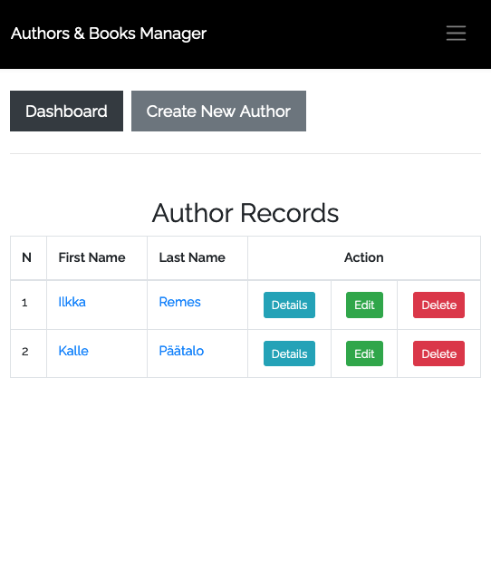
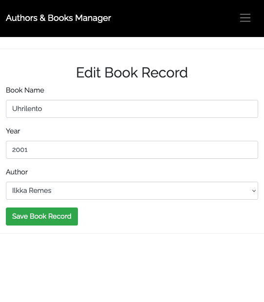

# authors-and-books

Laravel Authors and Books manager

    MVC
    Auth
    CRUD and Resource Controllers
    Eloquent and Relationships
    Database migrations and seeds
    Form Validation and Requests
    Basic Bootstrap front-end
    Pagination

